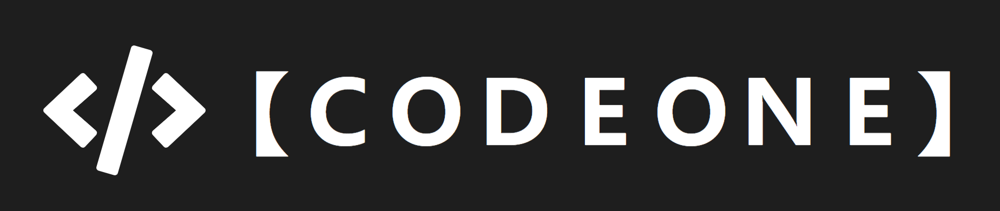
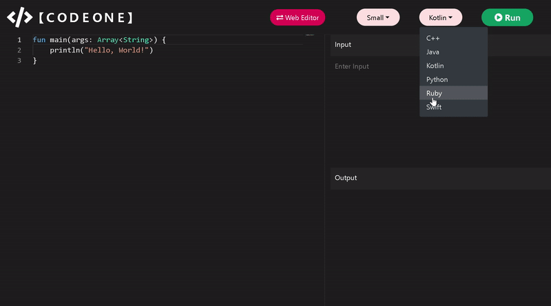
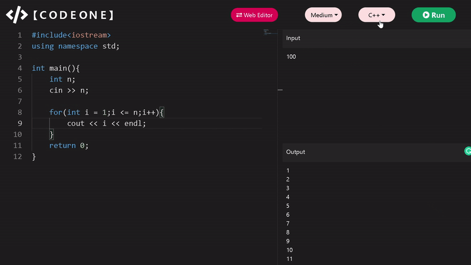
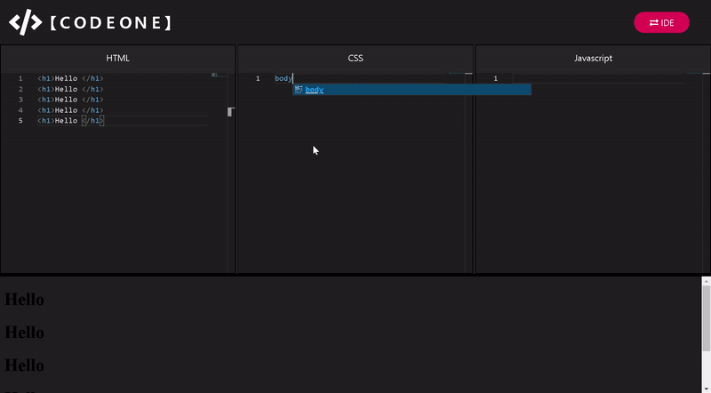

<div align = "center">
<hr>

 
<br><br>
  
[](https://codeone.netlify.app/)
[](https://github.com/DhruvPasricha/CodeOne)
[](https://github.com/DhruvPasricha/CodeOne/graphs/contributors)
[](https://reactjs.org/ )
[](https://github.com/DhruvPasricha/CodeOne/network)
[](https://github.com/DhruvPasricha/CodeOne/stargazers)


<br>
 
<hr>
<!-- LINK -->

### <a href="https://codeone.netlify.app">🔥 𝚅𝚒𝚎𝚠 𝙳𝚎𝚙𝚕𝚘𝚢𝚎𝚍 𝙿𝚛𝚘𝚓𝚎𝚌𝚝 🔥</a>

</div>

<hr>

## Description

***_Codeone_** is a web app built on top of React which includes an **_IDE_** supporting multiple languages for programming in addition with a highly customizable **_Web Editor_** supporting real time changes*

<div align = "center">


> IDE


> Web Editor

</div>
<hr>

**Languages Supported -**

> IDE :

```
1. C++
2. Python
3. Ruby
4. Swift
5. Kotlin
6. Java
```

> Web Editor :

```
1. HTML
2. CSS
3. Javascript
```

<hr>

### Thanks for visiting !!! We hope the project will come in great use 💯

**Do give it a star if you liked our work**✨


